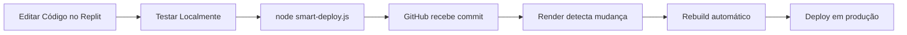

# 🚀 Guia de Deploy Autônomo - GitHub + Render

> **Manual Técnico para Replicação em Outros Projetos Replit**
> 
> Este documento detalha o sistema de deploy autônomo desenvolvido para PingPong Pro, permitindo que aplicações funcionem completamente independentes do Replit, com atualizações automáticas via GitHub e hospedagem no Render.

---

## 📋 Índice

1. [Visão Geral da Arquitetura](#visão-geral-da-arquitetura)
2. [Componentes do Sistema](#componentes-do-sistema)
3. [Configuração Inicial](#configuração-inicial)
4. [Script de Deploy Inteligente](#script-de-deploy-inteligente)
5. [Workflow de Desenvolvimento](#workflow-de-desenvolvimento)
6. [Replicação em Outros Apps](#replicação-em-outros-apps)
7. [Troubleshooting](#troubleshooting)
8. [Melhores Práticas](#melhores-práticas)

---

## 🏗️ Visão Geral da Arquitetura

### Objetivo
Criar um sistema onde:
- ✅ App roda **100% autônomo** no Render (sem Replit)
- ✅ Atualizações feitas no Replit são **automaticamente deployadas**
- ✅ GitHub atua como **repositório central**
- ✅ Render faz **rebuild automático** ao detectar mudanças
- ✅ Zero intervenção manual necessária

### Fluxo de Dados

```
┌─────────────┐
│   REPLIT    │ (Desenvolvimento)
│  (Dev Env)  │
└─────┬───────┘
      │
      │ smart-deploy.js
      ↓
┌─────────────┐
│   GITHUB    │ (Versionamento)
│ (Repository)│
└─────┬───────┘
      │
      │ Auto-Deploy Webhook
      ↓
┌─────────────┐
│   RENDER    │ (Produção)
│ (Hosting)   │
└─────────────┘
```

---

## 🔧 Componentes do Sistema

### 1. **smart-deploy.js** - Script de Deploy Inteligente

**Localização:** `smart-deploy.js` (raiz do projeto)

**Funcionalidades:**
- ✅ Detecção inteligente de mudanças (compara árvore local vs remota)
- ✅ Deploy em batches (máx 100 arquivos por commit)
- ✅ Preservação de estrutura de pastas
- ✅ Logging detalhado com timestamps
- ✅ Tratamento de erros robusto
- ✅ Suporte a múltiplos tipos de arquivo

**Tecnologias:**
```json
{
  "@octokit/rest": "^21.0.0"  // GitHub API Client
}
```

**Secrets Necessários:**
```bash
GITHUB_TOKEN=ghp_xxx...  # Personal Access Token do GitHub
```

### 2. **.gitignore** - Controle de Arquivos

**Arquivos SEMPRE ignorados:**
```gitignore
# Desenvolvimento Local
node_modules/
.replit
replit.nix
*.log

# Build e Cache
dist/
.vite/
*.tsbuildinfo

# Secrets (NUNCA commitados)
.env
.env.local
.env.production
```

### 3. **Render.yaml** - Configuração de Deploy

**Localização:** `render.yaml` (raiz do projeto)

```yaml
services:
  - type: web
    name: pingpong-pro
    runtime: node
    buildCommand: npm install && npm run build
    startCommand: npm start
    envVars:
      - key: NODE_ENV
        value: production
      - key: DATABASE_URL
        sync: false  # Configurado manualmente no Render
```

### 4. **Package.json** - Scripts de Build

```json
{
  "scripts": {
    "dev": "tsx server/index.ts",
    "build": "vite build",
    "start": "NODE_ENV=production tsx server/index.ts",
    "deploy": "node smart-deploy.js"
  }
}
```

---

## ⚙️ Configuração Inicial

### Passo 1: Configurar GitHub Repository

```bash
# 1. Criar repositório no GitHub
# Via interface web: https://github.com/new

# 2. Obter Personal Access Token
# GitHub → Settings → Developer Settings → Personal Access Tokens
# Permissões necessárias: repo (full control)
```

### Passo 2: Configurar Secrets no Replit

```bash
# Na interface do Replit:
# Tools → Secrets → Add Secret

GITHUB_TOKEN=ghp_seu_token_aqui
```

### Passo 3: Criar smart-deploy.js

**Copie o arquivo completo do projeto atual:**
```bash
cp smart-deploy.js /path/to/new/project/
```

**Adapte as variáveis:**
```javascript
const GITHUB_OWNER = 'seu-usuario';  // Seu usuário GitHub
const GITHUB_REPO = 'nome-do-repo';  // Nome do repositório
const GITHUB_BRANCH = 'main';        // Branch principal
```

### Passo 4: Configurar Render

```bash
# 1. Criar conta no Render.com
# 2. New → Web Service
# 3. Conectar repositório GitHub
# 4. Configurar:
#    - Build Command: npm install && npm run build
#    - Start Command: npm start
#    - Environment: Node
# 5. Adicionar variáveis de ambiente:
#    DATABASE_URL, SESSION_SECRET, etc.
```

### Passo 5: Ativar Auto-Deploy no Render

```bash
# Na dashboard do Render:
# Settings → Build & Deploy
# ✅ Auto-Deploy: Yes
# Branch: main
```

---

## 🤖 Script de Deploy Inteligente

### Anatomia do smart-deploy.js

#### 1. **Detecção de Mudanças**

```javascript
async function detectChanges() {
  // 1. Lista todos os arquivos locais
  const localFiles = await getLocalFiles('.');
  
  // 2. Busca árvore remota do GitHub
  const remoteTree = await getRemoteTree();
  
  // 3. Compara SHA256 de cada arquivo
  const changes = {
    new: [],      // Arquivos novos
    updated: [],  // Arquivos modificados
    deleted: []   // Arquivos removidos
  };
  
  // 4. Detecta tipo de mudança
  for (const file of localFiles) {
    const localSha = await getFileSha(file);
    const remoteSha = remoteTree[file]?.sha;
    
    if (!remoteSha) {
      changes.new.push(file);
    } else if (localSha !== remoteSha) {
      changes.updated.push(file);
    }
  }
  
  return changes;
}
```

#### 2. **Deploy em Batches**

```javascript
async function deployInBatches(files) {
  const BATCH_SIZE = 100;  // Limite do GitHub API
  const batches = [];
  
  // Divide em grupos de 100
  for (let i = 0; i < files.length; i += BATCH_SIZE) {
    batches.push(files.slice(i, i + BATCH_SIZE));
  }
  
  // Deploy sequencial de cada batch
  for (const batch of batches) {
    await deployBatch(batch);
  }
}
```

#### 3. **Criação de Blob e Tree**

```javascript
async function deployBatch(files) {
  // 1. Criar blob para cada arquivo
  const blobs = await Promise.all(
    files.map(file => octokit.git.createBlob({
      owner: GITHUB_OWNER,
      repo: GITHUB_REPO,
      content: fs.readFileSync(file, 'base64'),
      encoding: 'base64'
    }))
  );
  
  // 2. Criar tree com estrutura de pastas
  const tree = files.map((file, i) => ({
    path: file,
    mode: '100644',
    type: 'blob',
    sha: blobs[i].data.sha
  }));
  
  // 3. Criar commit com a tree
  const commit = await octokit.git.createCommit({
    owner: GITHUB_OWNER,
    repo: GITHUB_REPO,
    message: `Deploy: ${files.length} files updated`,
    tree: treeData.sha,
    parents: [latestCommit.sha]
  });
  
  // 4. Atualizar referência da branch
  await octokit.git.updateRef({
    owner: GITHUB_OWNER,
    repo: GITHUB_REPO,
    ref: `heads/${GITHUB_BRANCH}`,
    sha: commit.data.sha
  });
}
```

### Executando o Deploy

```bash
# Método 1: Via script npm
npm run deploy

# Método 2: Direto via Node
node smart-deploy.js

# Método 3: Com logs detalhados
node smart-deploy.js 2>&1 | tee deploy.log
```

### Output do Deploy

```bash
[2:17:14 PM] 🚀 SMART-DEPLOY: 🔑 Conectando ao GitHub...
[2:17:14 PM] 🚀 SMART-DEPLOY: 🔍 Detectando mudanças...
[2:17:14 PM] 🚀 SMART-DEPLOY: 🌳 Obtendo árvore remota...
[2:17:15 PM] 🚀 SMART-DEPLOY: 📁 Encontrados 212 arquivos locais
[2:17:15 PM] 🚀 SMART-DEPLOY: 📊 Mudanças detectadas: 0 novos, 5 atualizados, 1 deletados
[2:17:15 PM] 🚀 SMART-DEPLOY: 🔄 Iniciando deploy em 1 batches...
[2:17:15 PM] 🚀 SMART-DEPLOY: 📦 Deployando batch 1 com 6 arquivos...
[2:17:16 PM] 🚀 SMART-DEPLOY: ✅ Deploy completo! 6 arquivos deployados em 1 batches
[2:17:16 PM] 🚀 SMART-DEPLOY: 🌐 Render irá fazer rebuild em alguns minutos
```

---

## 🔄 Workflow de Desenvolvimento

### Ciclo Completo: Dev → Produção



### Desenvolvimento Diário

1. **Fazer alterações no código** (Replit)
   ```bash
   # Editar arquivos normalmente
   vim client/src/pages/home.tsx
   ```

2. **Testar localmente**
   ```bash
   npm run dev
   # Abrir: http://localhost:5000
   ```

3. **Deploy para produção**
   ```bash
   node smart-deploy.js
   # Aguardar: ~3-5 minutos para rebuild
   ```

4. **Verificar produção**
   ```bash
   # Abrir: https://seu-app.onrender.com
   ```

### Rollback em Caso de Erro

```bash
# Via GitHub:
# 1. Ir para repositório no GitHub
# 2. Commits → Encontrar último commit bom
# 3. "Revert this commit"

# Render fará rebuild automaticamente com o código anterior
```

---

## 🔄 Replicação em Outros Apps

### Checklist para Novo Projeto

- [ ] **1. Preparar Projeto Replit**
  ```bash
  # Verificar estrutura de arquivos
  ls -la
  
  # Garantir que .gitignore existe
  cat .gitignore
  ```

- [ ] **2. Criar Repositório GitHub**
  ```bash
  # Via web: github.com/new
  # Nome: nome-do-projeto
  # Privado ou Público conforme necessidade
  ```

- [ ] **3. Configurar GitHub Token**
  ```bash
  # GitHub → Settings → Developer Settings
  # Personal Access Tokens → Generate New Token
  # Scopes: repo (full control)
  
  # No Replit: Tools → Secrets
  GITHUB_TOKEN=ghp_xxx...
  ```

- [ ] **4. Copiar smart-deploy.js**
  ```bash
  # Do projeto PingPong Pro para novo projeto
  cp smart-deploy.js /path/to/new-project/
  ```

- [ ] **5. Adaptar Configurações**
  ```javascript
  // Em smart-deploy.js, atualizar:
  const GITHUB_OWNER = 'seu-usuario';
  const GITHUB_REPO = 'novo-projeto';
  const GITHUB_BRANCH = 'main';
  ```

- [ ] **6. Configurar .gitignore**
  ```bash
  # Copiar ou criar novo
  cp .gitignore /path/to/new-project/
  
  # Adicionar regras específicas se necessário
  echo "*.log" >> .gitignore
  ```

- [ ] **7. Primeiro Deploy**
  ```bash
  cd /path/to/new-project
  node smart-deploy.js
  
  # Verificar no GitHub se arquivos foram enviados
  ```

- [ ] **8. Configurar Render**
  ```bash
  # render.com → New Web Service
  # Connect GitHub Repository
  # Build: npm install && npm run build
  # Start: npm start
  # Auto-Deploy: ON
  ```

- [ ] **9. Configurar Variáveis de Ambiente**
  ```bash
  # No Render Dashboard → Environment
  DATABASE_URL=postgresql://...
  SESSION_SECRET=xxx
  NODE_ENV=production
  # Outras variáveis específicas do projeto
  ```

- [ ] **10. Testar Deploy Automático**
  ```bash
  # Fazer uma mudança simples
  echo "// Test" >> README.md
  
  # Deploy
  node smart-deploy.js
  
  # Verificar rebuild no Render
  # Dashboard → Events (deve mostrar "Deploy started")
  ```

### Template de Comandos (Copy/Paste)

```bash
# === SETUP INICIAL ===

# 1. Copiar smart-deploy.js
cp /path/to/pingpong-pro/smart-deploy.js .

# 2. Copiar .gitignore
cp /path/to/pingpong-pro/.gitignore .

# 3. Instalar dependência (se não tiver)
npm install @octokit/rest

# 4. Adicionar script no package.json
# "deploy": "node smart-deploy.js"

# 5. Primeiro deploy
node smart-deploy.js

# === DESENVOLVIMENTO DIÁRIO ===

# Editar código → Testar → Deploy
npm run dev          # Testar
node smart-deploy.js # Deploy

# === VERIFICAÇÃO ===

# Ver status no GitHub
# https://github.com/usuario/repo/commits/main

# Ver status no Render
# https://dashboard.render.com
```

---

## 🔍 Troubleshooting

### Problema 1: "GITHUB_TOKEN not found"

**Sintoma:**
```bash
Error: GITHUB_TOKEN environment variable not found
```

**Solução:**
```bash
# Verificar se secret existe
echo $GITHUB_TOKEN

# Se vazio, adicionar no Replit:
# Tools → Secrets → Add Secret
# Nome: GITHUB_TOKEN
# Valor: ghp_seu_token

# Reiniciar shell
exit
```

### Problema 2: "No changes detected"

**Sintoma:**
```bash
📊 Mudanças detectadas: 0 novos, 0 atualizados, 0 deletados
```

**Solução:**
```bash
# Verificar se arquivos realmente mudaram
git status

# Forçar atualização de arquivo
touch client/src/App.tsx
node smart-deploy.js

# Verificar SHA local vs remoto
node -e "console.log(require('crypto').createHash('sha1').update(require('fs').readFileSync('file.txt')).digest('hex'))"
```

### Problema 3: "API rate limit exceeded"

**Sintoma:**
```bash
Error: API rate limit exceeded for user
```

**Solução:**
```bash
# Aguardar 1 hora (limite reseta)

# Ou usar token com rate limit maior:
# GitHub → Settings → Developer Settings
# Criar novo token com escopo 'repo'
# Atualizar GITHUB_TOKEN no Replit
```

### Problema 4: "Render não faz rebuild"

**Sintoma:**
- Deploy no GitHub funciona
- Render não inicia rebuild

**Solução:**
```bash
# 1. Verificar Auto-Deploy no Render
# Settings → Build & Deploy → Auto-Deploy: ON

# 2. Verificar branch correto
# Settings → Build & Deploy → Branch: main

# 3. Forçar deploy manual
# Dashboard → Manual Deploy → Deploy latest commit

# 4. Verificar webhook
# Settings → Webhooks (deve ter webhook do GitHub)
```

### Problema 5: "Build failed no Render"

**Sintoma:**
```bash
Build failed: Module not found
```

**Solução:**
```bash
# 1. Verificar package.json completo no GitHub
# 2. Verificar dependências de build:
{
  "devDependencies": {
    "vite": "^5.0.0",
    "typescript": "^5.0.0",
    "@vitejs/plugin-react": "^4.0.0"
  }
}

# 3. Testar build local
npm run build

# 4. Verificar logs no Render
# Dashboard → Logs → Build Logs
```

---

## ✅ Melhores Práticas

### 1. **Commits Semânticos**

```javascript
// Em smart-deploy.js, customizar mensagens:
const commitMessage = `
feat: ${newFiles.length} new files
fix: ${updatedFiles.length} updates
remove: ${deletedFiles.length} deletions
`.trim();
```

### 2. **Ignorar Arquivos Sensíveis**

```gitignore
# NUNCA commitar:
.env
.env.local
.env.production
secrets/
*.key
*.pem
config/local.json
```

### 3. **Backup Antes de Deploy**

```bash
# Criar backup antes de deploy importante
tar -czf backup-$(date +%Y%m%d-%H%M%S).tar.gz \
  client/ server/ shared/

# Deploy
node smart-deploy.js
```

### 4. **Monitorar Logs de Produção**

```bash
# Render Dashboard → Logs → Runtime Logs
# Verificar erros após cada deploy

# Configurar alertas (Render Pro)
# Settings → Notifications → Slack/Email
```

### 5. **Versionamento Adequado**

```json
// package.json
{
  "version": "1.2.3",
  "scripts": {
    "deploy:patch": "npm version patch && node smart-deploy.js",
    "deploy:minor": "npm version minor && node smart-deploy.js",
    "deploy:major": "npm version major && node smart-deploy.js"
  }
}
```

### 6. **Testes Antes do Deploy**

```bash
# Script de deploy com validação
#!/bin/bash
set -e

echo "🧪 Running tests..."
npm test

echo "🔨 Building project..."
npm run build

echo "🚀 Deploying to GitHub..."
node smart-deploy.js

echo "✅ Deploy complete!"
```

### 7. **Rollback Rápido**

```bash
# Criar alias para rollback
# .bashrc ou .zshrc:
alias rollback='git revert HEAD && git push'

# Uso:
rollback  # Desfaz último commit e faz push
```

---

## 📊 Comparação: Antes vs Depois

### Antes (Deploy Manual)

```bash
# ❌ Processo manual complexo
1. git add .
2. git commit -m "update"
3. git push
4. Abrir Render Dashboard
5. Clicar em "Deploy"
6. Aguardar build
7. Verificar produção

# ⏱️ Tempo: ~10-15 minutos
# 😫 Complexidade: Alta
# 🐛 Erros comuns: Esquecer arquivos, commit errado
```

### Depois (Deploy Automático)

```bash
# ✅ Processo automatizado
1. node smart-deploy.js

# ⏱️ Tempo: ~30 segundos (+ 3-5min rebuild)
# 😊 Complexidade: Baixa
# 🎯 Erros: Praticamente zero
```

---

## 🎯 Checklist Final de Replicação

Ao configurar em novo projeto, verificar:

**Configuração Básica:**
- [ ] Repository GitHub criado
- [ ] Token GitHub configurado em Secrets
- [ ] smart-deploy.js copiado e adaptado
- [ ] .gitignore configurado corretamente
- [ ] package.json com script "deploy"

**GitHub:**
- [ ] Primeiro commit realizado com sucesso
- [ ] Arquivos aparecem no repositório
- [ ] Branch principal é 'main'

**Render:**
- [ ] Web Service criado e conectado ao GitHub
- [ ] Build command: `npm install && npm run build`
- [ ] Start command: `npm start`
- [ ] Auto-Deploy ativado
- [ ] Variáveis de ambiente configuradas
- [ ] Primeiro deploy manual bem-sucedido

**Testes:**
- [ ] Alteração de teste deployada com sucesso
- [ ] Render fez rebuild automático
- [ ] Aplicação funcionando em produção
- [ ] Logs sem erros

**Documentação:**
- [ ] README atualizado com instruções de deploy
- [ ] Variáveis de ambiente documentadas
- [ ] Processo de rollback documentado

---

## 📚 Recursos Adicionais

### Links Úteis

- **GitHub API Docs:** https://docs.github.com/en/rest
- **Octokit.js:** https://github.com/octokit/rest.js
- **Render Docs:** https://render.com/docs
- **Render Auto-Deploy:** https://render.com/docs/deploys

### Comandos de Diagnóstico

```bash
# Verificar conexão GitHub
curl -H "Authorization: token $GITHUB_TOKEN" \
  https://api.github.com/user

# Ver commits recentes
curl -H "Authorization: token $GITHUB_TOKEN" \
  https://api.github.com/repos/usuario/repo/commits

# Verificar status Render (se tiver API key)
curl https://api.render.com/v1/services \
  -H "Authorization: Bearer $RENDER_API_KEY"
```

### Estrutura de Arquivos Necessária

```
projeto/
├── smart-deploy.js          # ✅ Script de deploy
├── .gitignore              # ✅ Arquivos ignorados
├── package.json            # ✅ Com script "deploy"
├── render.yaml            # ✅ Config do Render (opcional)
├── client/                # ✅ Frontend
├── server/                # ✅ Backend
└── shared/                # ✅ Código compartilhado
```

---

## 🤝 Suporte

Para problemas ou dúvidas:

1. **Verificar Troubleshooting** (seção acima)
2. **Consultar logs:**
   - Replit: Terminal
   - GitHub: Actions tab
   - Render: Dashboard → Logs
3. **Testar localmente primeiro:**
   ```bash
   npm run dev
   npm run build
   ```
4. **Validar configurações:**
   ```bash
   echo $GITHUB_TOKEN  # Deve retornar o token
   cat .gitignore      # Deve ter regras corretas
   cat package.json    # Deve ter script deploy
   ```

---

## 📝 Changelog do Sistema de Deploy

### v1.0.0 - Sistema Inicial
- ✅ Deploy manual via Git
- ❌ Sem automação

### v2.0.0 - Smart Deploy
- ✅ Detecção automática de mudanças
- ✅ Deploy em batches
- ✅ Integração GitHub API
- ✅ Auto-rebuild no Render

### v2.1.0 - Melhorias (Atual)
- ✅ Logging com timestamps
- ✅ Tratamento robusto de erros
- ✅ Suporte a múltiplos tipos de arquivo
- ✅ Comparação SHA para mudanças
- ✅ Preservação de estrutura de pastas

---

## 🎓 Conclusão

Este sistema de deploy autônomo permite:

1. **Desenvolvimento ágil** - Deploy em segundos
2. **Zero manutenção** - Tudo automatizado
3. **Produção estável** - App roda sem Replit
4. **Fácil replicação** - Copiar para outros projetos
5. **Rollback simples** - Reverter em caso de erro

**Resultado:** Aplicação 100% autônoma, com atualizações contínuas e hospedagem profissional! 🚀

---

*Última atualização: Outubro 2025*
*Desenvolvido para: PingPong Pro Tournament System*
*Aplicável a: Qualquer projeto Node.js + React no Replit*
